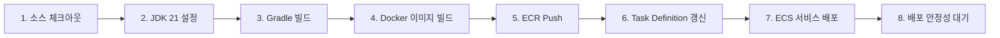
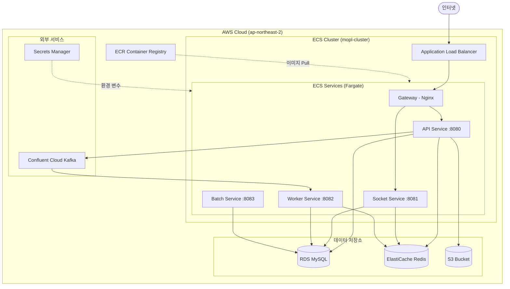
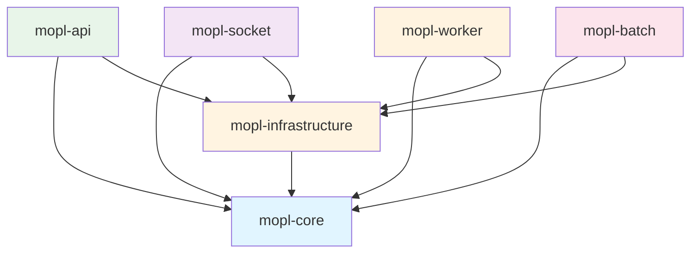

# 🎬 모두의 플리 (MOPL)

<div align="center">


### 대규모 트래픽을 고려한 글로벌 콘텐츠 큐레이션 & 소셜 플랫폼

[](https://github.com/KarubiOhayo/sb05-mopl-team3/actions)
[](LICENSE)
[](https://spring.io/projects/spring-boot)
[](https://openjdk.org/)

[🌐 배포 사이트](https://www.mopl.store/) | [📖 API 문서](https://project.sb.sprint.learn.codeit.kr/sb/mopl/api/swagger-ui.html) | [📝 협업 문서](https://www.notion.so/Project-Home-2cdfdef79f2d8073ae4ee3d060a0361a?source=copy_link)

</div>

---

## 💡 프로젝트 소개

**모두의 플리**는 영화, 드라마, 스포츠 등 다양한 콘텐츠를 **큐레이팅하고 공유**하며, **실시간으로 함께 시청**할 수 있는 소셜 플랫폼입니다.

사용자는 자신만의 플레이리스트를 만들고, 다른 사용자와 소통하며 콘텐츠 경험을 확장할 수 있습니다. 대규모 트래픽을 고려한 확장 가능한 아키텍처로 설계되어, 안정적이고 빠른 서비스를 제공합니다.

### 🎯 프로젝트 배경
- 대규모 트래픽을 고려한 확장 가능한 아키텍처 설계
- 멀티모듈 구조로 모듈별 독립 배포 및 확장성 확보
- 이벤트 기반 아키텍처로 모듈 간 느슨한 결합 구현

### 🎯 핵심 가치

- **🏗️ 멀티모듈 아키텍처**: API, Socket, Worker, Batch 모듈 독립 배포
- **🔐 안전한 사용자 관리**: JWT 기반 인증과 OAuth2 소셜 로그인 (Google, Kakao)
- **📝 개인화된 큐레이션**: 사용자 맞춤형 플레이리스트 생성 및 관리
- **⚡ 실시간 소통**: WebSocket 기반 실시간 시청 세션 및 DM
- **🔍 강력한 검색**: Elasticsearch를 활용한 Full-Text Search
- **📊 확장 가능한 설계**: 이벤트 기반 아키텍처로 모듈 간 느슨한 결합
- **☁️ 클라우드 네이티브**: AWS ECS 기반 컨테이너 배포 및 자동 확장
- **🚀 고성능 캐싱**: Redis를 활용한 세션 관리 및 데이터 캐싱
- **🔄 CI/CD 자동화**: GitHub Actions를 통한 자동 테스트 및 배포

### ✨ 주요 특징

| 기능 | 설명 |
|------|------|
| 🎭 **콘텐츠 큐레이션** | 나만의 플레이리스트 생성 및 공유 |
| ⭐ **리뷰 시스템** | 콘텐츠 평가 및 커뮤니티 피드백 |
| 👥 **소셜 네트워킹** | 팔로우, DM, 실시간 채팅 |
| 📺 **함께 보기** | WebSocket 기반 실시간 시청 세션 |
| 🔔 **실시간 알림** | SSE를 통한 즉각적인 알림 전달 |
| 🛡️ **관리자 기능** | 사용자 권한 관리 및 콘텐츠 관리 |

---

## 🎬 데모 계정

프로토타입에서 다음 계정으로 서비스를 체험해보실 수 있습니다:

| 닉네임 | 이메일 | 비밀번호 | 권한 |
|--------|--------|----------|------|
| admin | `admin@mopl.io` | `1234` | ADMIN |
| 우디 | `woody@mopl.io` | `1234` | USER |
| 버즈 | `buzz@mopl.io` | `1234` | USER |
| 제시 | `jessie@mopl.io` | `1234` | USER |
| 렉스 | `rex@mopl.io` | `1234` | USER |
| 슬링키 | `slinky@mopl.io` | `1234` | USER |

---

## 👥 팀원 및 역할

| 팀원 | 담당 모듈 | 주요 역할 |
|:---:|:---|:---|
| <br/>**김규섭**<br/>🎯 *Team Leader* | **Worker 모듈**<br/>Event Processing<br/>**Socket 모듈**<br/>Real-time<br/>**Batch 모듈**<br/>Scheduling | 멀티모듈 기반 프로젝트 초기 구조 설계 및 GitHub Repository 초기화<br/>AWS, Confluent Cloud, Grafana Cloud 등 클라우드 배포/인프라 환경 구축<br/>GitHub Actions Workflow를 통한 CI/CD 파이프라인 구축<br/>Spring Batch를 통한 외부 API로부터 컨텐츠 수집 및 저장 기능<br/>WS및 SSE 기반 실시간 채팅 세션/Direct Message 기능<br/>K6, Prometheus-Grafana 기반 모니터링·테스트 기반 구축 및 부하 테스트 수행<br/>콘텐츠 수집 배치 작업, dm 및 알림 저장, api 조회 기능의 성능 개선<br/>부하 테스트를 통한 각 컨테이너별 한계 RPS 탐색 및 목표 RPS를 달성하기 위한 배포 태스크 스펙 구성 |
| <br/>**권지인**<br/>💻 *Developer* | **API 모듈**<br/>Auth, User<br/>**Infra 모듈**<br/>Redis, Kafka | Notion 기반 협업 문서 설계 및 관리<br/>프로젝트 최종 발표 PPT 작성 및 구성<br/>JWT 기반 인증/인가 및 CSRF 보호를 포함한 Spring Security 설정<br/>OAuth2 기반 소셜 로그인 및 계정 연동 기능<br/>사용자 관리 (프로필, 권한, 계정 잠금) 및 S3 기반 이미지 업로드<br/>Redis 기반 Refresh Token 관리 및 분산 캐싱 전략<br/>Kafka 기반 도메인 이벤트 발행 (권한 변경, 계정 상태 변경) |
| <br/>**김찬혁**<br/>💻 *Developer* | **API 모듈**<br/>Playlist<br/>**Socket 모듈**<br/>Real-time | 팔로우 생성/취소/조회 및 자기팔로우·중복 요청 검증<br/>플레이리스트 CRUD, 소유자 권한 검증, 콘텐츠 추가/삭제, 구독/구독취소 및 구독자 수 집계<br/>알림 조회/삭제 API, 미읽음 카운트 Redis 캐싱 및 SSE 실시간 전송 파이프라인 구성<br/>모든 알림 이벤트 발행/소비/저장 구현 |
| <br/>**김준교**<br/>💻 *Developer* | **API 모듈**<br/>Contents | 컨텐츠 관리 및 S3 기반 이미지 업로드<br/>리뷰 생성/수정/삭제 시 콘텐츠 평점·리뷰 수 집계 반영 및 이벤트 발행/소비<br/>콘텐츠 조회(단건/목록) ES 기반 검색 전환<br/>실시간 시청자 수 및 리뷰 집계 배치 스케줄러 동기화 및 ES 반영 |
| <br/>**변우혁**<br/>💻 *Developer* | **API 모듈**<br/>Review | 발표 ppt 작성<br/>리뷰 도메인 CRUD 기능 구현<br/>- 단건 조회 / 목록 조회 분리<br/>- QueryDSL 도입<br/>- 커서 기반 페이지네이션 |

</div>

### 📋 공통 책임

- **코드 리뷰**: 모든 PR에 대해 SonarQube 및 CodeRabbit 정적 분석 도구를 활용한 코드 리뷰
- **문서화**: API 명세, 기술 문서, Trouble Shooting 기록
- **데일리 스크럼**: 매일 진행 상황 및 블로커 공유

### 🔄 협업 프로세스

- **브랜치 전략**: Git Flow (main, develop, feature/*, hotfix/*)
- **커밋 컨벤션**: Conventional Commits
- **이슈 관리**: GitHub Issues + Projects
- **커뮤니케이션**: Zep, Discord, Notion

---

## 🛠️ 기술 스택

### Front-end


### Back-end


### Database & Cache


### Message Queue & Search


### Real-time


### External API


### Cloud & Infrastructure


### DevOps


### Monitoring


### Testing


### Collaboration


---

## 🏗️ 시스템 아키텍처

### 🏗️ 멀티모듈 아키텍처

#### 모듈 구성
- **core**: 모듈 간 공유 계약 (이벤트 DTO, ErrorCode, 공통 Enum)
- **infrastructure**: 기술 구현체 통합 관리 (JPA, Redis, Kafka)
- **api**: REST API 서버 (도메인별 패키지 분리)
- **socket**: WebSocket/SSE 실시간 통신
- **worker**: Kafka 이벤트 비동기 처리
- **batch**: 정기 작업 (데이터 정리, 재집계)
- **gateway**: Nginx 리버스 프록시

#### 설계 원칙
1. ✅ 비즈니스 로직은 api 내부 도메인별 패키지로 구성
2. ✅ 각 도메인은 domain → application → api 계층 구조 유지
3. ✅ 인프라 구현체는 infrastructure 패키지에서 통합 관리
4. ✅ 상태 변경은 Entity에서, 외부 의존성은 Application에서
5. ✅ Domain은 이벤트 생성, Application은 이벤트 발행
6. ✅ core 모듈에는 "계약"만, 비즈니스 로직 금지
7. ✅ 순환 참조 절대 금지

### 전체 아키텍처 다이어그램


### 주요 데이터 흐름

#### 1️⃣ 리뷰 생성 및 집계

```
사용자 → API (리뷰 생성) → MySQL 저장
         ↓
    Kafka Event 발행 (ReviewCreatedEvent)
         ↓
    Worker (이벤트 소비) → MySQL (콘텐츠 평균 평점 갱신)
```

#### 2️⃣ 실시간 알림 전달

```
API (알림 생성) → MySQL 저장
       ↓
  Kafka Event 발행
       ↓
Socket (SSE) → 사용자에게 실시간 전송
```

#### 3️⃣ 시청 세션 실시간 동기화

```
사용자 → Socket (WebSocket 연결)
         ↓
    Redis (세션 정보 저장)
         ↓
    다른 사용자에게 실시간 브로드캐스트
```

### 설계 원칙

#### 🔹 모듈 독립성

- 각 모듈은 독립적으로 배포 가능한 애플리케이션
- 모듈 간 직접 의존 금지 (Core, Infrastructure만 공유)
- Kafka 이벤트를 통한 느슨한 결합

#### 🔹 계층형 아키텍처 (API 내부)

```
api/
└── Controller (API 계층)
    ↓
    Service (Application 계층)
    ↓
    Repository (Domain 계층)
    ↓
    JPA/QueryDSL (Infrastructure 계층)
```

- Domain Entity는 상태 변경 로직만 포함
- Repository는 Application 계층에서만 호출
- Infrastructure는 기술별로 통합 관리

#### 🔹 이벤트 기반 통신

- **동기 처리**: REST API (API 모듈)
- **비동기 처리**: Kafka Event (Worker 모듈)
- **실시간 통신**: WebSocket/SSE (Socket 모듈)

#### 🔹 확장 가능한 설계

- **수평 확장**: Redis를 활용한 세션 클러스터링
- **자동 확장**: AWS ECS Fargate를 통한 컨테이너 오토 스케일링
- **부하 분산**: Nginx Gateway를 통한 로드 밸런싱

#### 🔹 보안 원칙

- JWT 토큰 기반 무상태 인증
- OAuth2 소셜 로그인 (Google, Kakao)
- CSRF 토큰을 통한 공격 방어
- Resilience4j Rate Limiter로 DDoS 방어

---

## ☁️ CI/CD & 배포

### 🔀 Git 브랜치 전략

**Git Flow** 전략을 기반으로 브랜치를 관리합니다.

```
main          ─────●────────●──────────●─────→  (프로덕션)
               ↗        ↗         ↗
develop   ────●────●───●─────●───●────────────→  (개발)
               ↑    ↓    ↑    ↓
feature/*      └─●──┘    └─●──┘                  (기능 개발)
                  
hotfix/*                  ●──→                    (긴급 수정)
                         ↗
release/*           ●────┘                        (배포 준비)
```

#### 주요 브랜치

| 브랜치 | 용도 | 병합 대상 |
|--------|------|-----------|
| `main` | 프로덕션 배포 브랜치 | - |
| `develop` | 개발 통합 브랜치 | `main` |
| `feature/*` | 기능 개발 브랜치 | `develop` |
| `hotfix/*` | 긴급 버그 수정 브랜치 | `main`, `develop` |
| `release/*` | 배포 준비 브랜치 | `main`, `develop` |

#### 커밋 컨벤션

**Conventional Commits** 규칙을 따릅니다.

```
<type>(<scope>): <subject>

예시:
feat(auth): OAuth2 소셜 로그인 구현
fix(api): 리뷰 평점 집계 오류 수정
docs(readme): 아키텍처 다이어그램 추가
```

**Type:**
- `feat`: 새로운 기능
- `fix`: 버그 수정
- `docs`: 문서 수정
- `test`: 테스트 추가/수정
- `refactor`: 코드 리팩토링
- `style`: 코드 포맷팅
- `chore`: 빌드/설정 변경

---

### 🔄 CI 파이프라인

**GitHub Actions**를 사용하여 자동화된 테스트 및 코드 품질 검사를 수행합니다.

#### 트리거 조건

- `main`, `develop`, `release/*`, `hotfix/*` 브랜치에 Push
- Pull Request 생성 시

#### 주요 단계

1. **코드 체크아웃** - 최신 소스코드 가져오기
2. **환경 설정** - JDK 21 (Temurin) 설치
3. **코드 스타일 검사** - Spotless로 코드 포맷팅 규칙 준수 확인
4. **빌드** - `./gradlew build -x test`
5. **테스트 실행** - `./gradlew test`
6. **테스트 결과 업로드** - 실패 시에도 리포트 확인 가능

---

### 🚀 CD 파이프라인

**AWS ECS Fargate**를 사용하여 컨테이너 기반 자동 배포를 수행합니다.

#### 트리거 조건

- `main` 브랜치에 Push
- 각 모듈별 파일 변경 감지

#### 배포 프로세스



#### 주요 단계 상세

| 단계 | 설명 | 도구 |
|------|------|------|
| **1. 소스 체크아웃** | GitHub 저장소에서 코드 가져오기 | `actions/checkout@v4` |
| **2. JDK 설정** | Java 21 (Temurin) 설치 | `actions/setup-java@v4` |
| **3. Gradle 빌드** | `./gradlew :mopl-{module}:bootJar -x test` | Gradle Wrapper |
| **4. Docker 이미지 빌드** | Dockerfile 기반 이미지 생성 | Docker |
| **5. ECR Push** | 이미지를 AWS ECR에 업로드 (태그: Git SHA) | `aws-actions/amazon-ecr-login@v2` |
| **6. Task Definition 갱신** | 새 이미지로 태스크 정의 업데이트 | `aws-actions/amazon-ecs-render-task-definition@v1` |
| **7. ECS 서비스 배포** | 롤링 업데이트 방식으로 배포 | `aws-actions/amazon-ecs-deploy-task-definition@v1` |
| **8. 안정성 대기** | 서비스 안정화 확인 (Health Check) | AWS ECS |

---

### 🏗️ AWS 인프라 구조



#### AWS 서비스 상세

| 서비스 | 용도 | 설정 |
|--------|------|------|
| **ECS Fargate** | 컨테이너 실행 환경 | CPU: 0.5 vCPU, Memory: 1GB |
| **ALB** | 로드 밸런싱 & SSL 종료 | Health Check 활성화 |
| **ECR** | Docker 이미지 저장소 | 모듈별 Repository |
| **RDS (MySQL)** | 관계형 데이터베이스 | Multi-AZ 배포 |
| **ElastiCache (Redis)** | 캐시 & 세션 저장소 | 클러스터 모드 |
| **S3** | 파일 스토리지 | 이미지, 정적 파일 저장 |
| **Secrets Manager** | 환경 변수 관리 | DB 비밀번호, API 키 등 |
| **Confluent Cloud** | Kafka 메시지 큐 | 이벤트 스트리밍 |

#### 배포 방식

**롤링 업데이트 (Rolling Update)**
- 기존 태스크를 점진적으로 새 태스크로 교체
- 무중단 배포 (Zero Downtime)
- Health Check 실패 시 자동 롤백

**환경 변수 관리**
- AWS Secrets Manager에서 중앙 관리
- ECS Task Definition에서 시크릿 참조
- 민감 정보 소스코드에서 분리

---

### 📊 모니터링 & 로깅

#### Prometheus & Grafana

**메트릭 수집**
- Spring Actuator `/actuator/prometheus` 엔드포인트
- Prometheus가 각 서비스에서 메트릭 스크래핑
- Grafana 대시보드로 시각화

**주요 메트릭**
- JVM 메모리 사용량
- HTTP 요청 수 & 응답 시간
- 데이터베이스 커넥션 풀 상태
- Kafka 이벤트 처리량
- WebSocket 연결 수

#### 로그 관리

- **CloudWatch Logs**: ECS 컨테이너 로그 자동 수집
- **로그 레벨**: INFO (운영), DEBUG (개발)
- **로그 보관**: 30일

---

### 🔒 보안 설정

- **IAM 역할**: 최소 권한 원칙 적용
- **보안 그룹**: 필요한 포트만 개방
- **VPC**: Private Subnet에 애플리케이션 배치
- **SSL/TLS**: ALB에서 HTTPS 종료
- **시크릿 관리**: Secrets Manager 사용

---

## 📂 패키지 구조

### 전체 프로젝트 구조
```
sb05-mopl-team3/
│
├── mopl-core/                              # 모듈 간 공유 계약
│   └── src/main/java/io/mopl/core/
│       ├── event/                          # Kafka 이벤트 DTO
│       │   ├── review/
│       │   │   ├── ReviewCreatedEvent.java
│       │   │   ├── ReviewUpdatedEvent.java
│       │   │   └── ReviewDeletedEvent.java
│       │   ├── playlist/
│       │   │   ├── PlaylistCreatedEvent.java
│       │   │   └── PlaylistUpdatedEvent.java
│       │   ├── notification/
│       │   │   └── NotificationEvent.java
│       │   └── watching/
│       │       └── WatchingSessionEvent.java
│       │
│       ├── exception/                      # 공통 에러 코드
│       │   ├── ErrorCode.java
│       │   └── ErrorResponse.java
│       │
│       └── constant/                       # 공통 상수
│           ├── KafkaTopics.java
│           └── RedisKeyPrefix.java
│
├── mopl-infrastructure/                    # 인프라 공통 설정
│   └── src/main/java/io/mopl/infrastructure/
│       ├── kafka/
│       │   ├── KafkaProducerConfig.java
│       │   ├── KafkaConsumerConfig.java
│       │   └── KafkaEventPublisher.java
│       │
│       ├── redis/
│       │   ├── RedisConfig.java
│       │   ├── RedisCacheConfig.java
│       │   └── RedisKeyGenerator.java
│       │
│       ├── jpa/
│       │   ├── JpaConfig.java
│       │   └── QueryDslConfig.java
│       │
│       └── s3/
│           ├── S3Config.java
│           └── S3FileUploader.java
│
├── mopl-api/                               # REST API 서버
│   ├── Dockerfile
│   └── src/main/java/io/mopl/api/
│       ├── ApiApplication.java
│       │
│       ├── config/                         # 전역 설정
│       │   ├── SecurityConfig.java
│       │   ├── WebConfig.java
│       │   ├── SwaggerConfig.java
│       │   └── MessageSourceConfig.java
│       │
│       ├── common/                         # 전역 공통 모듈
│       │   ├── entity/
│       │   │   ├── BaseEntity.java
│       │   │   └── BaseTimeEntity.java
│       │   │
│       │   ├── exception/
│       │   │   ├── BusinessException.java
│       │   │   ├── GlobalExceptionHandler.java
│       │   │   └── ErrorResponse.java
│       │   │
│       │   ├── dto/
│       │   │   ├── CursorRequest.java
│       │   │   └── CursorResponse.java
│       │   │
│       │   └── util/
│       │       ├── DateUtil.java
│       │       ├── StringUtil.java
│       │       └── CursorEncoder.java
│       │
│       ├── auth/                           # 인증/인가 도메인
│       │   ├── domain/
│       │   │   ├── RefreshToken.java
│       │   │   ├── RefreshTokenRepository.java
│       │   │   ├── TemporaryPassword.java
│       │   │   └── TemporaryPasswordRepository.java
│       │   │
│       │   ├── application/
│       │   │   ├── AuthService.java
│       │   │   ├── JwtTokenProvider.java
│       │   │   ├── OAuth2Service.java
│       │   │   └── PasswordResetService.java
│       │   │
│       │   ├── api/
│       │   │   ├── AuthController.java
│       │   │   └── OAuth2Controller.java
│       │   │
│       │   ├── dto/
│       │   │   ├── SignInRequest.java
│       │   │   ├── SignInResponse.java
│       │   │   ├── SignUpRequest.java
│       │   │   ├── JwtDto.java
│       │   │   ├── ResetPasswordRequest.java
│       │   │   └── OAuth2LinkRequest.java
│       │   │
│       │   └── security/
│       │       ├── JwtAuthenticationFilter.java
│       │       ├── JwtAuthenticationEntryPoint.java
│       │       ├── CsrfTokenFilter.java
│       │       └── CustomUserDetails.java
│       │
│       ├── user/                           # 사용자 관리 도메인
│       │   ├── domain/
│       │   │   ├── User.java
│       │   │   ├── UserRepository.java
│       │   │   ├── Role.java
│       │   │   └── SocialAccount.java
│       │   │
│       │   ├── application/
│       │   │   ├── UserService.java
│       │   │   ├── UserProfileService.java
│       │   │   └── AdminUserService.java
│       │   │
│       │   ├── api/
│       │   │   ├── UserController.java
│       │   │   └── AdminUserController.java
│       │   │
│       │   └── dto/
│       │       ├── UserDto.java
│       │       ├── UserCreateRequest.java
│       │       ├── UserUpdateRequest.java
│       │       ├── ProfileUpdateRequest.java
│       │       └── UserSearchCondition.java
│       │
│       ├── content/                        # 콘텐츠 관리 도메인
│       │   ├── domain/
│       │   │   ├── Content.java
│       │   │   ├── ContentRepository.java
│       │   │   ├── Tag.java
│       │   │   ├── TagRepository.java
│       │   │   ├── ContentTag.java
│       │   │   └── ContentType.java
│       │   │
│       │   ├── application/
│       │   │   ├── ContentService.java
│       │   │   ├── ContentSearchService.java
│       │   │   └── TagService.java
│       │   │
│       │   ├── api/
│       │   │   ├── ContentController.java
│       │   │   └── AdminContentController.java
│       │   │
│       │   └── dto/
│       │       ├── ContentDto.java
│       │       ├── ContentCreateRequest.java
│       │       ├── ContentUpdateRequest.java
│       │       ├── ContentSearchRequest.java
│       │       └── TagDto.java
│       │
│       ├── playlist/                       # 플레이리스트 도메인
│       │   ├── domain/
│       │   │   ├── Playlist.java
│       │   │   ├── PlaylistRepository.java
│       │   │   ├── PlaylistContent.java
│       │   │   ├── PlaylistContentRepository.java
│       │   │   ├── PlaylistSubscription.java
│       │   │   └── PlaylistSubscriptionRepository.java
│       │   │
│       │   ├── application/
│       │   │   ├── PlaylistService.java
│       │   │   ├── PlaylistContentService.java
│       │   │   └── PlaylistSubscriptionService.java
│       │   │
│       │   ├── api/
│       │   │   └── PlaylistController.java
│       │   │
│       │   └── dto/
│       │       ├── PlaylistDto.java
│       │       ├── PlaylistCreateRequest.java
│       │       ├── PlaylistUpdateRequest.java
│       │       ├── PlaylistContentDto.java
│       │       └── PlaylistSubscriptionDto.java
│       │
│       ├── review/                         # 리뷰 도메인
│       │   ├── domain/
│       │   │   ├── Review.java
│       │   │   └── ReviewRepository.java
│       │   │
│       │   ├── application/
│       │   │   ├── ReviewService.java
│       │   │   └── ReviewEventPublisher.java
│       │   │
│       │   ├── api/
│       │   │   └── ReviewController.java
│       │   │
│       │   └── dto/
│       │       ├── ReviewDto.java
│       │       ├── ReviewCreateRequest.java
│       │       ├── ReviewUpdateRequest.java
│       │       └── ReviewSearchCondition.java
│       │
│       ├── follow/                         # 팔로우 도메인
│       │   ├── domain/
│       │   │   ├── Follow.java
│       │   │   └── FollowRepository.java
│       │   │
│       │   ├── application/
│       │   │   └── FollowService.java
│       │   │
│       │   ├── api/
│       │   │   └── FollowController.java
│       │   │
│       │   └── dto/
│       │       ├── FollowDto.java
│       │       └── FollowerDto.java
│       │
│       ├── notification/                   # 알림 도메인
│       │   ├── domain/
│       │   │   ├── Notification.java
│       │   │   ├── NotificationRepository.java
│       │   │   └── NotificationLevel.java
│       │   │
│       │   ├── application/
│       │   │   └── NotificationService.java
│       │   │
│       │   ├── api/
│       │   │   └── NotificationController.java
│       │   │
│       │   └── dto/
│       │       ├── NotificationDto.java
│       │       └── NotificationCreateRequest.java
│       │
│       ├── message/                        # DM(Direct Message) 도메인
│       │   ├── domain/
│       │   │   ├── Conversation.java
│       │   │   ├── ConversationRepository.java
│       │   │   ├── ConversationParticipant.java
│       │   │   ├── ConversationParticipantRepository.java
│       │   │   ├── DirectMessage.java
│       │   │   └── DirectMessageRepository.java
│       │   │
│       │   ├── application/
│       │   │   ├── ConversationService.java
│       │   │   └── DirectMessageService.java
│       │   │
│       │   ├── api/
│       │   │   └── DirectMessageController.java
│       │   │
│       │   └── dto/
│       │       ├── ConversationDto.java
│       │       ├── DirectMessageDto.java
│       │       └── DirectMessageCreateRequest.java
│       │
│       └── watching/                       # 시청 세션 도메인
│           ├── domain/
│           │   ├── WatchingSession.java
│           │   └── WatchingSessionRepository.java
│           │
│           ├── application/
│           │   └── WatchingSessionService.java
│           │
│           ├── api/
│           │   └── WatchingSessionController.java
│           │
│           └── dto/
│               ├── WatchingSessionDto.java
│               └── WatchingSessionCreateRequest.java
│
├── mopl-socket/                            # WebSocket/SSE 실시간 통신
│   ├── Dockerfile
│   └── src/main/java/io/mopl/socket/
│       ├── SocketApplication.java
│       │
│       ├── config/
│       │   ├── WebSocketConfig.java
│       │   ├── RedisMessageListenerConfig.java
│       │   └── SecurityConfig.java
│       │
│       ├── watching/                       # 실시간 시청 세션
│       │   ├── WatchingSessionHandler.java
│       │   ├── WatchingSessionService.java
│       │   └── dto/
│       │       ├── WatchingMessage.java
│       │       └── SessionState.java
│       │
│       ├── chat/                          # 실시간 채팅
│       │   ├── ChatMessageHandler.java
│       │   ├── ChatRoomService.java
│       │   └── dto/
│       │       ├── ChatMessage.java
│       │       └── ChatRoom.java
│       │
│       └── notification/                   # SSE 실시간 알림
│           ├── NotificationSseController.java
│           ├── NotificationSseService.java
│           └── NotificationRedisSubscriber.java
│
├── mopl-worker/                            # Kafka 이벤트 처리
│   ├── Dockerfile
│   └── src/main/java/io/mopl/worker/
│       ├── WorkerApplication.java
│       │
│       ├── config/
│       │   ├── KafkaConsumerConfig.java
│       │   └── RedisConfig.java
│       │
│       ├── review/                        # 리뷰 이벤트 처리
│       │   ├── ReviewEventConsumer.java
│       │   ├── ReviewAggregationService.java
│       │   └── ContentStatisticsUpdater.java
│       │
│       ├── notification/                   # 알림 생성 및 발송
│       │   ├── NotificationEventConsumer.java
│       │   ├── NotificationGenerator.java
│       │   └── NotificationPublisher.java
│       │
│       ├── playlist/                       # 플레이리스트 이벤트 처리
│       │   ├── PlaylistEventConsumer.java
│       │   └── PlaylistCacheUpdater.java
│       │
│       └── auth/                          # 인증 관련 비동기 처리
│           ├── EmailService.java
│           └── PasswordResetEventConsumer.java
│
├── mopl-batch/                             # 정기 배치 작업
│   ├── Dockerfile
│   └── src/main/java/io/mopl/batch/
│       ├── BatchApplication.java
│       │
│       ├── config/
│       │   ├── BatchConfig.java
│       │   └── SchedulerConfig.java
│       │
│       ├── content/                       # 콘텐츠 데이터 수집
│       │   ├── ContentCollectorJob.java
│       │   ├── ContentCollectorTasklet.java
│       │   └── ExternalApiClient.java
│       │
│       ├── statistics/                     # 통계 재계산
│       │   ├── StatisticsRecalculationJob.java
│       │   └── ContentStatisticsCalculator.java
│       │
│       ├── elasticsearch/                  # Elasticsearch 동기화
│       │   ├── ElasticsearchSyncJob.java
│       │   └── ContentIndexer.java
│       │
│       └── cleanup/                        # 데이터 정리
│           ├── DataCleanupJob.java
│           └── ExpiredDataRemover.java
│
├── gateway/                                # Nginx 리버스 프록시
│   ├── nginx.conf
│   ├── Dockerfile
│   └── docker-compose.yml
│
├── monitoring/                             # Prometheus & Grafana
│   ├── prometheus/
│   │   ├── prometheus.yml
│   │   └── alert-rules.yml
│   │
│   └── grafana/
│       ├── dashboards/
│       │   ├── api-dashboard.json
│       │   ├── jvm-dashboard.json
│       │   └── kafka-dashboard.json
│       │
│       └── provisioning/
│           ├── datasources.yml
│           └── dashboards.yml
│
├── docker-compose.yml                      # 로컬 개발 환경
├── .github/
│   └── workflows/
│       ├── ci.yml                         # CI 파이프라인
│       ├── deploy-api.yml                 # API 배포
│       ├── deploy-socket.yml              # Socket 배포
│       ├── deploy-worker.yml              # Worker 배포
│       └── deploy-batch.yml               # Batch 배포
│
├── build.gradle                           # 루트 빌드 설정
├── settings.gradle                        # 멀티모듈 설정
└── README.md
```

### 계층별 책임

#### Domain Layer (domain/)
- **Entity**: JPA 엔티티 및 비즈니스 로직
- **Repository**: 데이터 접근 인터페이스
- **Value Object**: 도메인 값 객체

#### Application Layer (application/)
- **Service**: 유스케이스 조합 및 트랜잭션 관리
- **Event Publisher**: 도메인 이벤트 발행
- **Mapper**: DTO ↔ Entity 변환

#### API Layer (api/)
- **Controller**: HTTP 요청/응답 처리
- **DTO**: Request/Response 객체
- **Validator**: 입력 검증

### 모듈 간 의존성 규칙


**의존성 방향**:
- ✅ 모든 애플리케이션 모듈은 `core`와 `infrastructure`를 의존
- ✅ `infrastructure`는 `core`를 의존
- ❌ 애플리케이션 모듈끼리 직접 의존 금지
- ❌ 순환 참조 절대 금지

---

<div align="center">

**Made with ❤️ by Team 3**

[🔝 Back to Top](#-모두의-플리-mopl)

</div>
